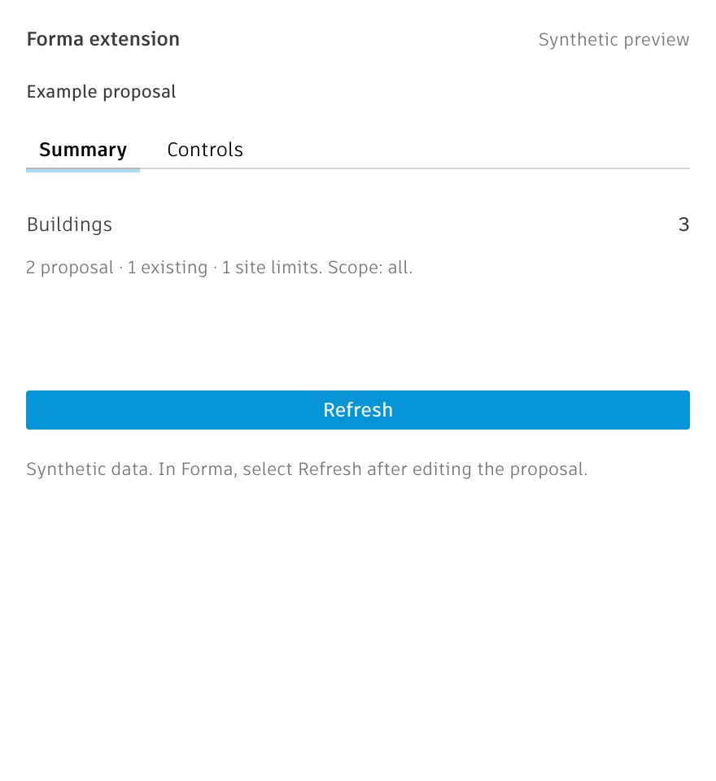

<p align="center">
  
</p>

# Autodesk Forma extension template

A Vite and TypeScript starter for Forma Site Design extensions with native Autodesk UI.

[](https://github.com/sharafutdinovdi/autodesk-forma-extension-template/actions/workflows/ci.yml)
[](LICENSE)
[](https://aps.autodesk.com/en/docs/forma/v1/overview/)
[](https://nodejs.org/)

## Use this template

Without GitHub, scaffold the same project from a terminal:

```sh
npm create forma-extension@latest my-extension
```

Click [**Use this template → Create a new repository**](https://github.com/sharafutdinovdi/autodesk-forma-extension-template/generate), then clone your repository and open its directory.
Use Node 20+ and npm. Run:

```sh
npm ci
node scripts/rename.mjs "My Extension"
npm run dev
```

Renaming is optional; `npm ci` and `npm run dev` are enough to start.
The rename command updates the display name, HTML title, package name, lockfile and README heading.
It refuses a dirty git tree. After reviewing and committing the rename, the same name is a no-op.
Replace this README's repository links with your own when publishing your extension.

The app runs at **http://localhost:5173**. Vite fails if that port is occupied.
Outside Forma, open [the synthetic preview](http://localhost:5173/?fixture=1).
It needs no Forma licence and never loads the SDK, including inside an iframe.
The native UI still needs an internet connection to Autodesk's CDN.

## Register it in Forma

Use a Forma Site Design project you can edit, in a hub where you have Design access.
These setup steps reflect the source project's September 2026 observations; current form choices and localhost policy remain unverified in other projects.

1. Open **Extension menu → Add extension → settings (gear) → Create extension**.
2. Set **Name**. Choose **Myself only** as Owner for personal development; this observed flow needs no APS application.
3. In **Who are allowed**, allowlist your project's `pro_…` authcontext or ACC project ID. Projects outside the allowlist will not show it in **Add extension**.
4. Fill **Feedback link** and **Help link** with working URLs. Under **Integration → Embedded views**, select **RIGHT_MENU_ANALYSIS_PANEL** and enter `http://localhost:5173/`.
5. Paste [forma/buttons.yaml](forma/buttons.yaml) into **Integration → Buttons**:

```yaml
- label: Open full panel
  actions:
    click:
      type: OPEN_FLOATING_PANEL
      url: http://localhost:5173/
      preferredSize:
        width: 440
        height: 720
```

6. Fill Presentation's **Provider**, **Description** and **Text to show**. Save, reopen settings to confirm persistence, then add the extension to the project.

`OPEN_FLOATING_PANEL` is a button action. Both placements use the same bundle and URL.
Below 300 px, the app shows a compact summary. At 300 px and wider, it shows Summary and Controls tabs.
Select **Open full panel** in the toolbar for the floating view.



The screenshot uses synthetic data at 440 CSS px and device scale 2.

## What you get

- Vite, strict TypeScript and a lockfile. Runtime dependencies are `forma-extension-kit` and SDK **0.96.0**, retained directly to satisfy the kit's peer dependency.
- Autodesk [base.css](https://app.autodeskforma.eu/design-system/v2/forma/styles/base.css), Artifakt type and CDN Weave tabs, select, primary button and inline error banner. No Weave npm package.
- Local 4/8/16 px spacing, 24 px controls and 11/12 px type roles, accounting for the Design System's 10 px root.
- Two tabs, a metric row, a working building-scope select and a locale-safe decimal input. The example limit demonstrates input only; it does not filter buildings.
- Compact right-panel and full floating layouts. Each view reads independently; select Refresh after proposal edits. There is no shared mutable state or overlay in this starter.
- Host adapters from [`forma-extension-kit`](https://www.npmjs.com/package/forma-extension-kit) ([repository](https://github.com/sharafutdinovdi/forma-extension-kit)): persisted proposal reads, singular `building` and `site_limit` paths, deduplicated building counts and base-group classification. `src/host.ts` selects fixture data or kit reads and prepares the proposal summary.
- The kit's on-demand `readFootprint(path, snapshot)` adapter: graph and floor representations → direct footprint → complete child footprints → XY triangles → final direct-footprint retry. It checks the revision and retains failed-provider diagnostics.
- Ready, loading, actionable empty and retryable error states. Use `?fixture=1&state=empty`, `state=loading` or `state=error`; Retry/Refresh returns the fixture to ready.
- A clean-tree rename script, MIT licence, contribution/security guidance, issue/PR templates, Dependabot and CI for Node 20/22.

The default metric counts buildings across the proposal, including context; it does not calculate parcel membership or floor area.
Site limits are listed without silently choosing a parcel. Add explicit selection before parcel calculations.
Geometry is loaded on demand, so missing footprints cannot erase buildings from the summary.

`readFootprint` returns `{ footprint, attempts }`. A footprint is a **set union**: `operation: "union"` with polygon `parts`, each containing an outer ring followed by holes in proposal XY coordinates.
The parts may overlap. They preserve disconnected regions and holes but are **not dissolved boundary rings**; never sum their areas or treat them as a disjoint GeoJSON MultiPolygon.
Use a polygon boolean library in your extension if you need dissolved boundaries or area calculations, as the full example does.
An unavailable footprint is `null`, with exact provider errors, never a fabricated zero.

Local fixture checks do not verify host registration, live geometry provider availability, coordinate placement or panel lifecycle.
Before shipping, check both placements, an Overture building, an authored building, site limits and proposal switching in your target Forma project.
The adapter uses the 0.96.0 proposal APIs; that SDK deprecates them in favour of UDM.

Motion: no signature effect or custom transitions/keyframes; only native Weave states. Animation dependencies add **0 kB**.
The app adds no movement to suppress under `prefers-reduced-motion`. The CDN's native tab transitions may remain; their behavior is Autodesk-owned.

## Gotchas the template already handles

`forma-extension-kit` handles the adapter and decimal gotchas below; the template supplies the input controls and keeps panel state and overlay ownership explicit.

- Locale decimals: editable numbers use text, `inputmode="decimal"` and ungrouped `Intl.NumberFormat("en-US")`; both `.` and `,` are accepted.
- Singular category: request `building`, not `buildings`; site limits use `site_limit`.
- Base-group classification: existing buildings come from ancestor flags or base-group URNs, never a guessed substring in the building's own URN.
- Authored buildings: `getFootprint` can return `undefined`; read representations, actual child keys and triangles before declaring geometry unavailable.
- Separate iframes: two placements share no JavaScript memory. This starter keeps them independent; synchronize proposal/root-scoped state explicitly when you add shared controls.
- Overlay ownership: the view that calculates should own its meshes. This read-only starter creates none; when adding overlays, prevent peers from drawing duplicates and verify cleanup on close.

## Going further

The [APS Forma extension skill](https://github.com/autodesk-platform-services/skills/tree/main/skills/aps-forma-extension) documents setup, geometry, synchronization and overlays. This is its intended upstream location **once merged**; availability is not yet verified.
See [forma-zoning-check](https://github.com/sharafutdinovdi/forma-zoning-check) for a full extension with geometry calculations, cross-panel synchronization and overlays.
Consult the [Forma Design System](https://app.autodeskforma.eu/design-system/v2/docs/) for native component APIs.

To share an extension beyond yourself, follow Autodesk's [sharing guide](https://aps.autodesk.com/en/docs/forma/v1/overview/sharing-extensions/): APS application ownership and a public hosted URL are separate from this local setup.
Marketplace publication has its own [publishing and design review](https://aps.autodesk.com/en/docs/forma/v1/overview/publishing-extensions/) process.

## Licence

[MIT](LICENSE) · Copyright (c) 2026 Dinar Sharafutdinov.
The included logo is original template artwork. This community template is not an Autodesk product.
